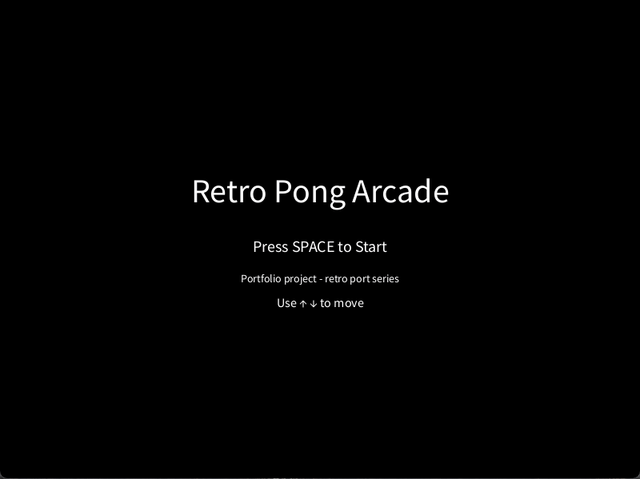
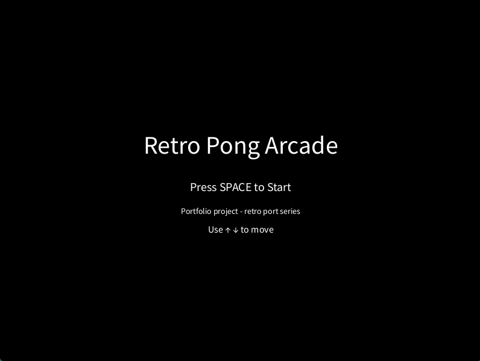
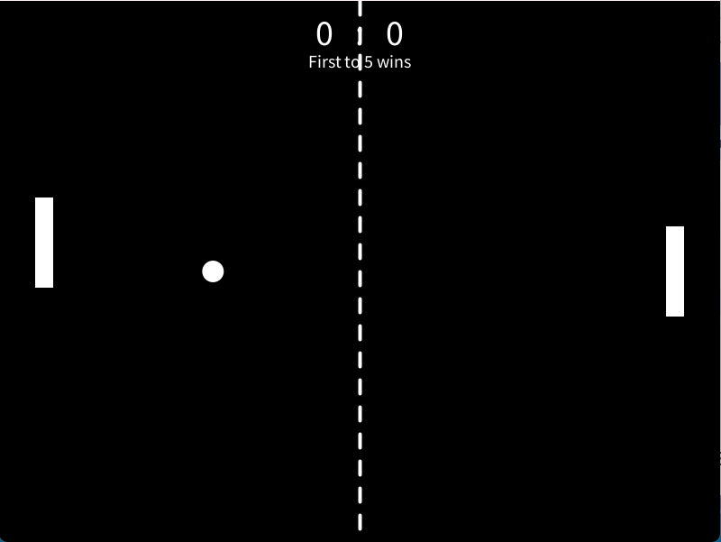
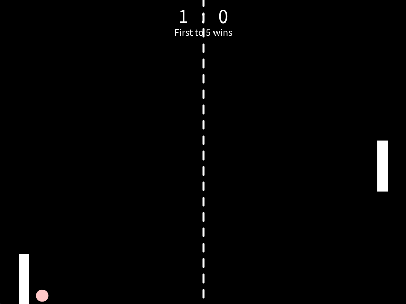
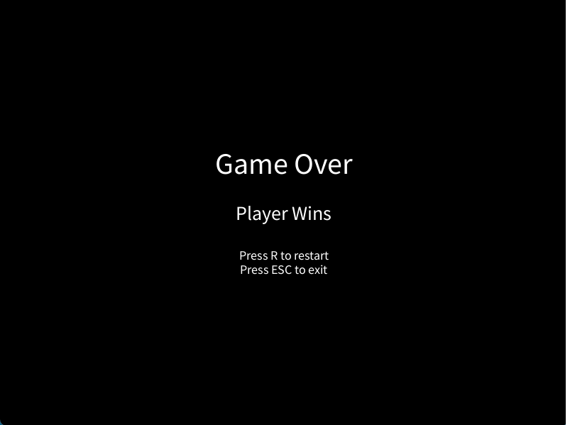
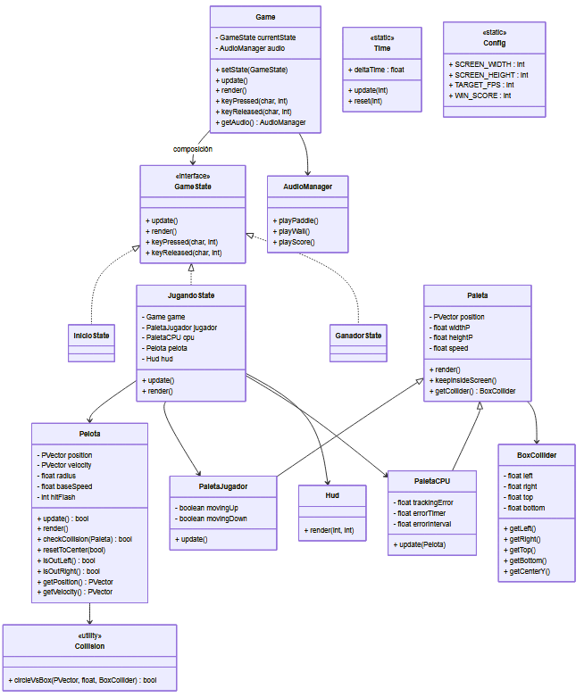
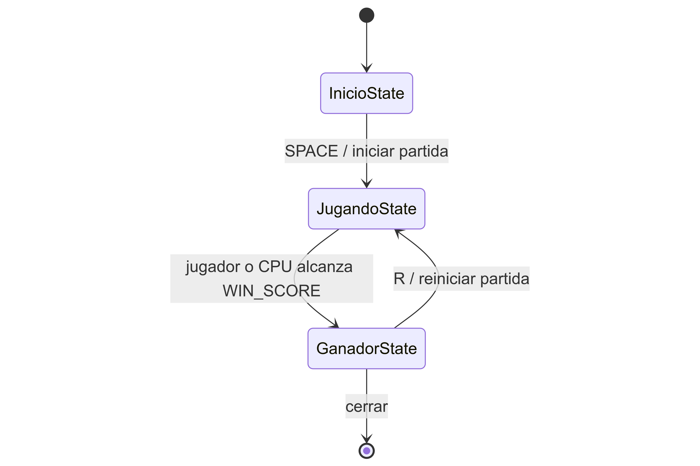

# 🎮 Retro Pong Arcade (Processing)

**Reimplementación del clásico Pong con arquitectura modular, documentación progresiva y enfoque pedagógico-profesional.**

<p align="center">
  
</p>

> Proyecto desarrollado como base para una serie de ports retro con enfoque arquitectónico y pedagógico.

---

## 🧠 Descripción

Este proyecto consiste en la reconstrucción del clásico Pong utilizando Processing, con el objetivo de desarrollar un videojuego completo aplicando buenas prácticas de diseño de software.

No se trata solo de un clon, sino de una implementación que busca:

* Modelar correctamente un juego 2D
* Aplicar principios de programación orientada a objetos
* Implementar una arquitectura clara y escalable
* Documentar el proceso de desarrollo
* Servir como base para futuros ports retro

---

## 📸 Capturas

<p align="center">
  <br/>
  <em>Pantalla de inicio</em>
</p>

<p align="center">
  
  <br/>
  <em>Gameplay y colisiones</em>
</p>

<p align="center">
  <br/>
  <em>Pantalla de fin de juego</em>
</p>

---

## 🔗 Navegación rápida

- 📚 [Lab 01 — Core Loop](labs/lab01-core-loop.md)
- 📚 [Lab 02 — Entidades y movimiento](labs/lab02-entities-and-movement.md)
- 📚 [Lab 03 — Colisiones](labs/lab03-collisions.md)
- 📚 [Lab 04 — Reglas de Pong](labs/lab04-core-pong-rules.md)
- 📚 [Lab 05 — CPU y flujo de juego](labs/lab05-cpu-and-game-flow.md)
- 📚 [Lab 06 Parte01 — Polish y Balance del juego](labs/lab06-polish-and-balance.md)
- 📚 [Lab 06 Parte02 — Audio del juego](labs/lab06-audio.md)  
- 🧠 [Teoría — Game Loop](docs/theory/game-loop.md)
- 🧠 [Teoría — Sistema de colisiones](docs/theory/collision-system.md)
- 🧠 [Teoría — Reglas de juego](docs/theory/game-rules.md)
- 🧠 [Teoría — IA simple](docs/theory/simple-ai.md)
- 🧠 [Teoría — Estados de juego](docs/theory/game-states.md)
- 🧠 [Teoría — Balance de juego](docs/theory/game-balance.md)
- 🧠 [Teoría — Audio en videojuegos 2D](docs/theory/game-audio.md)
- 🧱 [Diseño — Diagrama de clases](docs/diagrams/class-diagram.md)
- 🧱 [Diseño — Diagrama de estados](docs/diagrams/state-diagram.md)  
- 🎯 [Visión del proyecto](docs/design/vision.md)  
- 🗺️ [Roadmap](docs/design/roadmap.md)

---

## 🎯 Objetivos

* Implementar el **Game Loop (input → update → collision → rules → render)**
* Utilizar **delta time** para independencia del frame rate
* Modelar el flujo del juego mediante **máquina de estados**
* Diseñar entidades desacopladas (Pelota, Paleta, etc.)
* Construir un proyecto reutilizable y escalable

---

## 🕹️ Características

* Jugador vs CPU
* Sistema de puntaje
* Estados de juego (Inicio, Jugando, Fin)
* Colisiones pelota-paleta y pelota-pared
* Incremento progresivo de dificultad mediante velocidad de la pelota
* HUD con visualización de puntaje
* Feedback visual (flash de colisión)
* Feedback sonoro (colisiones, rebotes y puntaje)

---

## 🧱 Arquitectura

La arquitectura evoluciona progresivamente a lo largo de los laboratorios.
El proyecto se organiza en capas con responsabilidades claramente diferenciadas:

### Núcleo

- `Game` → coordina el estado actual del juego  
- `Time` → gestiona el delta time  
- `Config` → define constantes globales  

---

### Estados

- `InicioState` → pantalla inicial  
- `JugandoState` → lógica principal del juego  
- `GanadorState` → muestra el resultado del juego y permite reiniciar   

---

### Entidades

- `Pelota` → objeto dinámico principal  
- `Paleta` → entidad base  
- `PaletaJugador` → controlada por el jugador  
- `PaletaCPU` → controlada por una IA básica reactiva 

---

### Sistema de colisiones

- `BoxCollider` → representación geométrica (rectángulo)  
- `Collision` → lógica de detección de intersecciones  

---

### Interfaz de usuario

- `Hud` → visualización del puntaje  

---

### Audio

- `AudioManager` → gestión y reproducción de sonidos del juego

---

### Organización del flujo

El sistema sigue una arquitectura basada en estados:

```text
Game → GameState → Entidades → Colisiones → Reglas → Render (UI)
```
## 🔁 Game Loop
El juego sigue el siguiente flujo:
```text
input → update → collision → rules → render
```

Este enfoque permite separar claramente:

* captura de entrada
* actualización de estado
* renderizado

---
## 📁 Estructura del proyecto

```text
retro-01-pong-arcade/
├── Archivos Processing (.pde)
│   ├── retro_01_pong_arcade.pde   # Sketch principal
│   ├── Game.pde                   # Coordinador del juego
│   ├── GameState.pde              # Interfaz de estados
│   ├── AudioManager.pde
│   ├── InicioState.pde
│   ├── JugandoState.pde
│   ├── GanadorState.pde
│   ├── Paleta.pde
│   ├── PaletaJugador.pde
│   ├── PaletaCPU.pde
│   ├── Pelota.pde
│   ├── BoxCollider.pde
│   ├── Collision.pde
│   ├── Hud.pde
│   ├── Time.pde
│   └── Config.pde
│
├── docs/
│   ├── design/
│   └── theory/
│   └── diagrams/
│
├── labs/
│
├── assets/
│
└── README.md
```
> En Processing, todos los archivos `.pde` forman parte de un mismo sketch.
---
## 📚 Enfoque didáctico

El proyecto incluye una serie de laboratorios progresivos:

- [Lab 01 — Core Loop y estructura base](labs/lab01-core-loop.md)
- [Lab 02 — Entidades y movimiento](labs/lab02-entities-and-movement.md)
- [Lab 03 — Colisiones](labs/lab03-collisions.md)
- [Lab 04 — Reglas de Pong](labs/lab04-core-pong-rules.md)
- [Lab 05 — CPU y flujo de juego](labs/lab05-cpu-and-game-flow.md)
- [Lab 06 Parte01 — Polish y Balance del juego](labs/lab06-polish-and-balance.md)
- [Lab 06 Parte02 — Audio del juego](labs/lab06-audio.md)

---

## 📖 Documentación

* Teoría → `docs/theory/`
    - [Game Loop](docs/theory/game-loop.md)
    - [Sistema de colisiones](docs/theory/collision-system.md)
    - [IA simple](docs/theory/simple-ai.md)
    - [Reglas de juego](docs/theory/game-rules.md)
    - [Estados de juego](docs/theory/game-states.md)
    - [Balance de juego](docs/theory/game-balance.md)
    - [Audio de videojuegos 2D](docs/theory/game-audio.md)
* Diseño → `docs/design/`
    - [Visión del proyecto](docs/design/vision.md)  
    - [Roadmap de desarrollo](docs/design/roadmap.md)
* Diagramas → `docs/diagrams/`
    - [Diagrama de clases](docs/diagrams/class-diagram.md)
    - [Diagrama de estados](docs/diagrams/state-diagram.md)
* Bitácora → `docs/devlog/`

---

## 🚀 Roadmap

Consultar: [Roadmap de desarrollo](docs/design/roadmap.md)

---

## ▶️ Ejecución

1. Abrir el proyecto en Processing
2. Ejecutar el sketch principal
3. Interactuar mediante teclado

---

## 🧱 Diagrama de clases



---

## 🧱 Diagrama de estados



---

## 📌 Estado del proyecto

🟢 Finalizado — versión jugable completa con IA, balance, audio y documentación.

🔵 Extensible — base preparada para nuevos ports y mejoras futuras.

---

## 👨‍🏫 Contexto académico

Este proyecto está diseñado como recurso para:

* Fundamentos de Programación Orientada a Objetos
* Programación de Videojuegos
* Modelado de sistemas interactivos

---

## 👨‍💻 Autor

**Mg. Ing. Ariel Alejandro Vega**  
Universidad Nacional de Jujuy – Facultad de Ingeniería  

🔗 [LinkedIn](https://www.linkedin.com/in/ariel-alejandro-vega/)  
📧 avega@fi.unju.edu.ar

---

## 📄 Licencia

MIT License (pendiente de incorporación)
