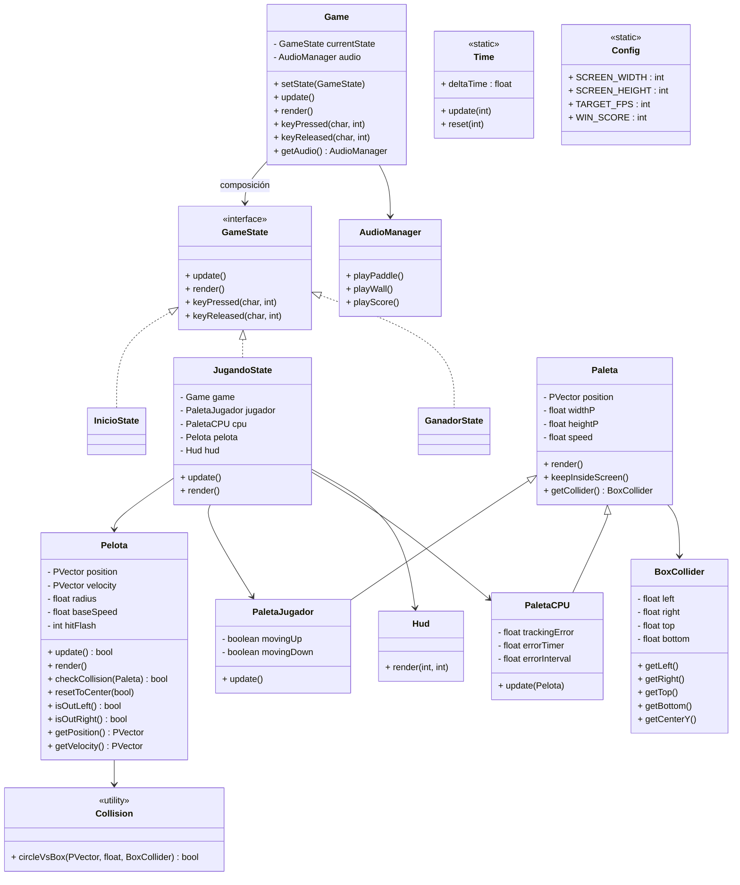

# 🧱 Diagrama de clases

```mermaid
classDiagram

%% =========================
%% Núcleo
%% =========================

class Game {
  - GameState currentState
  - AudioManager audio
  + setState(GameState)
  + update()
  + render()
  + keyPressed(char, int)
  + keyReleased(char, int)
  + getAudio() AudioManager
}

class Time {
  <<static>>
  + deltaTime : float
  + update(int)
  + reset(int)
}

class Config {
  <<static>>
  + SCREEN_WIDTH : int
  + SCREEN_HEIGHT : int
  + TARGET_FPS : int
  + WIN_SCORE : int
}

%% =========================
%% Estados
%% =========================

class GameState {
  <<interface>>
  + update()
  + render()
  + keyPressed(char, int)
  + keyReleased(char, int)
}

class InicioState
class JugandoState {
  - Game game
  - PaletaJugador jugador
  - PaletaCPU cpu
  - Pelota pelota
  - Hud hud
  + update()
  + render()
}

class GanadorState

GameState <|.. InicioState
GameState <|.. JugandoState
GameState <|.. GanadorState

Game --> GameState : composición
Game --> AudioManager

%% =========================
%% Entidades
%% =========================

class Pelota {
  - PVector position
  - PVector velocity
  - float radius
  - float baseSpeed
  - int hitFlash
  + update() bool
  + render()
  + checkCollision(Paleta) bool
  + resetToCenter(bool)
  + isOutLeft() bool
  + isOutRight() bool
  + getPosition() PVector
  + getVelocity() PVector
}

class Paleta {
  - PVector position
  - float widthP
  - float heightP
  - float speed
  + render()
  + keepInsideScreen()
  + getCollider() BoxCollider
}

class PaletaJugador {
  - boolean movingUp
  - boolean movingDown
  + update()
}

class PaletaCPU {
  - float trackingError
  - float errorTimer
  - float errorInterval
  + update(Pelota)
}

Paleta <|-- PaletaJugador
Paleta <|-- PaletaCPU

%% =========================
%% Colisiones
%% =========================

class BoxCollider {
  - float left
  - float right
  - float top
  - float bottom
  + getLeft()
  + getRight()
  + getTop()
  + getBottom()
  + getCenterY()
}

class Collision {
  <<utility>>
  + circleVsBox(PVector, float, BoxCollider) bool
}

Paleta --> BoxCollider
Pelota --> Collision

%% =========================
%% UI y Audio
%% =========================

class Hud {
  + render(int, int)
}

class AudioManager {
  + playPaddle()
  + playWall()
  + playScore()
}

JugandoState --> Pelota
JugandoState --> PaletaJugador
JugandoState --> PaletaCPU
JugandoState --> Hud
```
---

⬅️ [Volver al README](../../README.md)  
🏠 [Repositorio principal](https://github.com/aralvega/retro-01-pong-arcade)
